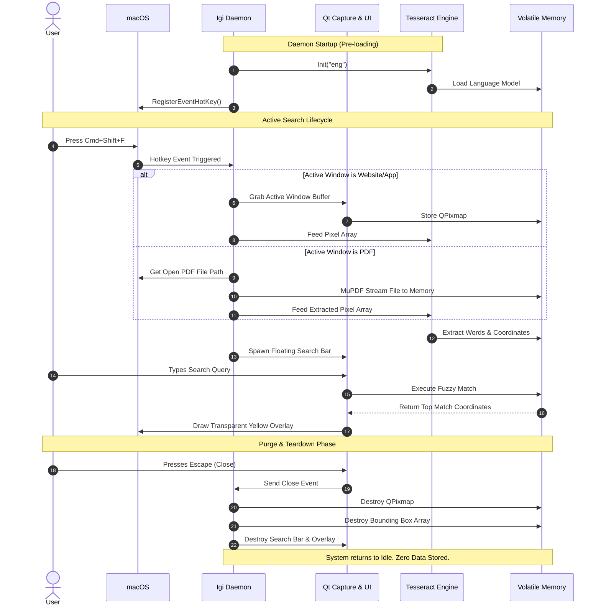
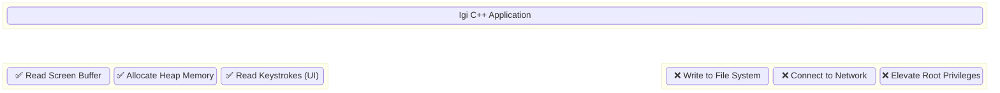

# Igi: Core Systems Architecture

This document maps the exact C++ components, external dependencies, and memory lifecycles required to execute the ultra-low latency OCR pipeline within a zero-storage constraint.

## 1. High-Level Component Architecture
This diagram outlines the distinct modules of the application and how they interact. The entire system is built around the Qt Framework for UI/Events and Tesseract for data processing.

```mermaid
graph TD
    subgraph macOS Environment
        A[macOS Event Loop]
        B[Active Window / Screen Buffer]
    end

    subgraph Igi Daemon Engine (C++)
        C(Global Hotkey Listener)
        D(Qt Screen Capture Engine)
        E[Volatile RAM Data Array]
        
        subgraph OCR Pipeline
            F(Leptonica Image Processor)
            G(Tesseract C++ API)
            K(MuPDF Memory Loader)
        end
        
        subgraph UI Overlay System
            H(Qt Frameless Search Bar)
            I(Fuzzy Match Algorithm)
            J(Qt Transparent Highlight Polygon)
        end
    end

    A -- "Cmd+Shift+F" --> C
    C --> D
    B -- "Read Pixels" --> D
    B -- "Detect PDF File Path" --> K
    D -- "QPixmap -> PIX Array" --> F
    K -- "Raw Bytes -> PIX Array" --> F
    F --> G
    G -- "Words + Bounding Boxes" --> E
    
    C --> H
    H -- "User Input" --> I
    E -- "Data Lookup" --> I
    I -- "Coordinates (x,y,w,h)" --> J
    J -- "Render Highlight" --> B
```

---

## 2. The Microsecond Execution Sequence
This sequence diagram illustrates the exact chronological workflow of a search operation. It highlights the strict initialization and destruction phases required to support HIPAA-aligned workflows (see `docs/DECISIONS.md` D-007 for the read/write boundary).



---

## 3. Memory & Security Isolation Layer
Because Igi is a zero-storage application, it is critical to understand the boundaries of what the C++ application is allowed to access.


