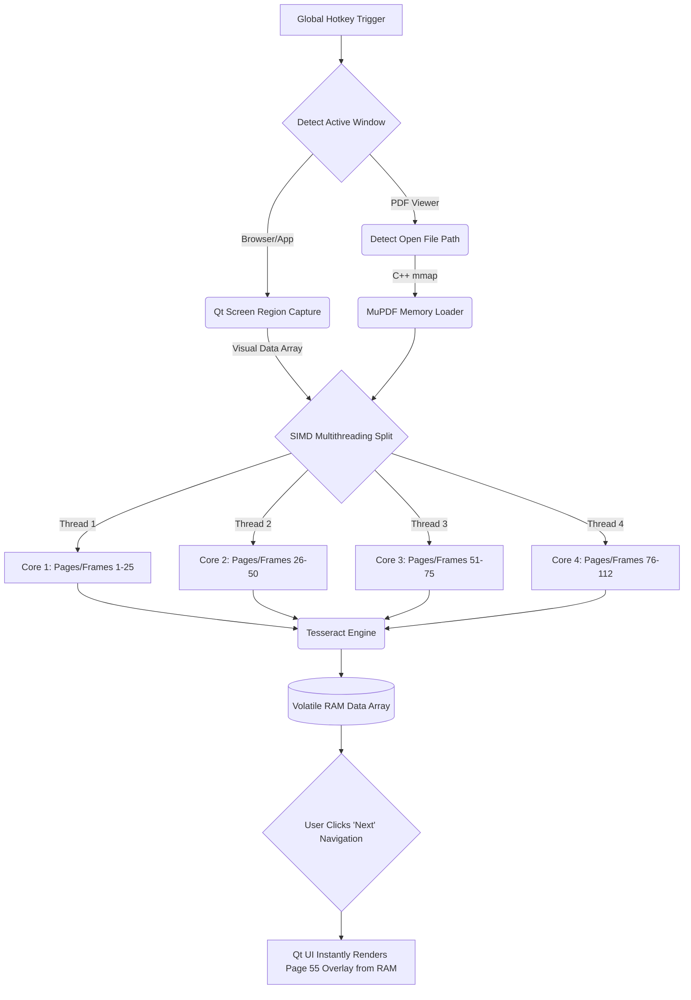

# 🖼 Igi Visual Pipelines

As requested, here are the "imageified" concept blueprints of the Igi tool. Because visual image generators are conceptual, I have also paired each image with its strict, rigid engineering `mermaid` flowchart so you have both the aesthetic vision and the exact mathematical logic.

## 1. System UI & UX Concept
A visual representation of the minimalist, dark-mode floating search bar operating over a scanned medical document. 


---

## 2. High-Level Offline Architecture Pipeline
A conceptual visualization of the high-performance OCR data pipeline.


### Strict Logic Flow (Engineering Standard)
This is the actual, programmed logic representing how the C++ application bypasses the hard drive and multi-threads the 112-page document.



---

## 3. The Algorithmic Matrix
A conceptual visualization of the neural networks and mathematical algorithms processing the text in the background.


### Strict Algorithmic Data Flow
This is the step-by-step mathematical lifecycle of a single word moving from raw pixels to a highlighted result on the screen.

```mermaid
flowchart LR
    A[Raw RGB Pixels] --> B[Otsu's Method Binarization]
    B -->|Maximizes Contrast| C(LSTM Neural Network OCR)
    C -->|Text & Coordinates| D[Wagner-Fischer Distance Matrix]
    D -->|O N Bitap Match| E{Fuzzy Match Confidence > 90%?}
    E -- Yes --> F[Affine Matrix Transform]
    F -->|Scale & Translate (x, y)| G[Draw Yellow Polygon]
    E -- No --> H[Discard Pointer]
```
